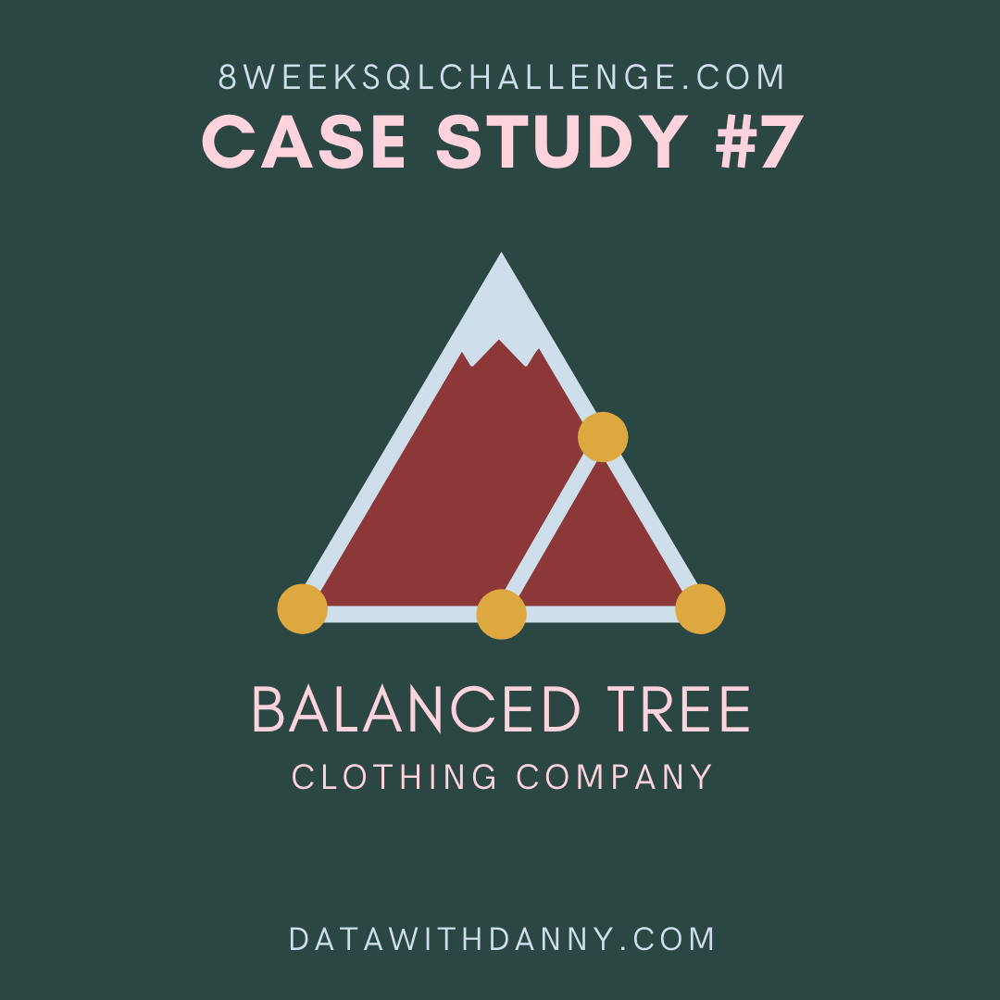

# 8-Week-SQL-Challenge
SQL is a highly sought after skill in the data analysis world and what better way to learn SQL than through a case study. That is what my data mentor and <a href="https://8weeksqlchallenge.com/">8 Week SQL Challenge</a> creator Danny Ma thought as well. Not only has he created the 8 Week Challenge, he is also the creator of the <a href="https://www.datawithdanny.com/">Serious SQL</a> course as well.

The challenge is meant to help students of SQL like myself learn SQL and all it can do via case studies. Most companies when hiring are looking for people with the SQL skill set already but getting the skills outside of either work or a course is difficult. 

Over the next few weeks I will look to solve the business problems the ficticious companies are having in the case studies.

### First Challenge - Danny's Diner
Status: Done ✔️

The first challenge that I have will be solving questions for Danny's Diner. The Japanese restaurant is looking to expand on their loyalty program.

 
For more information about the Week 1 Challenge, <a href="https://8weeksqlchallenge.com/case-study-1/">click here</a>.

### Second Challenge - Pizza Runner
Status: Done ✔️

The second challenge takes me back to my roots and my favorite food, PIZZA! I have worked in a few pizza restaurants growing up. But the challenge that I have accepted is to help with data collect and analysis to help business growth.

Pizza Runner is an "Uberized" pizza company that has started to recruit "Runners" to deliver pizza to people.

 
For more information about the Week 2 Challenge, <a href="https://8weeksqlchallenge.com/case-study-2/">click here</a>.

### Third Challenge - Foodie-Fi
Status: Done ✔️

The third challenge revolves around a subscription based business filling in a gap. The gap being there isn't a streaming service that is dedicated to only cooking and food related shows.

 
For more information about the Week 3 Challenge, <a href="https://8weeksqlchallenge.com/case-study-3/">click here</a>.

### Fourth Challenge - Digital Bank
Status: Done ✔️

The fourth challenge revolves digital bank, Data-Banks. Data Banks run just like any other digital bank, but they also have the world's most secure distributed data storage platform. This is all about calculating metrics, gorwth and forecasting.

 
For more information about the Week 4 Challenge, <a href="https://8weeksqlchallenge.com/case-study-4/">click here</a>.

### Fifth Challenge - Data Mart
Status: Done ✔️

The fifth challenge revolves around Danny's new venture, online supermarket internation operations which specialized in fresh produce. Danny needs help to quantify the impact of this change on the sales performance for Data Mart and its separate business areas.

 
For more information about the Week 5 Challenge, <a href="https://8weeksqlchallenge.com/case-study-5/">click here</a>.

### Sixth Challenge - Clique Bait
Status: Done ✔️

The Sixth challenge follows the Seafoodprenuer and CEO Danny. I am required to support Danny's vision and analyze the data and come up with creative solutions to calculate funnel rollout rates for Clique Bait's online store

 
For more information about the Week 6 Challenge, <a href="https://8weeksqlchallenge.com/case-study-6/">click here</a>.

### Seventh Challenge - Balance Tree
Status: Done ✔️

The Seventh challenge follows the Balanced Tree Clothing Company which prides themselves on providing an optimised range of clothing and lifestyle wear forthe modern adventurer. The CEO Danny, is asking for assistance for the merchandising team as they analyze their sales performance and to generate basic financial reports to share with the wider business.

 
For more information about the Week 7 Challenge, <a href="https://8weeksqlchallenge.com/case-study-7/">click here</a>.

### Eigth Challenge - Balance Tree
Status: Under Construction 🚧

The Eigth challenge follows Danny in his new adventure of Fresh Segments. A digital marketing agency that helps other business analyze trends in online click behanvoir for their unique customer base.

 
For more information about the Week 8 Challenge, <a href="https://8weeksqlchallenge.com/case-study-8/">click here</a>.