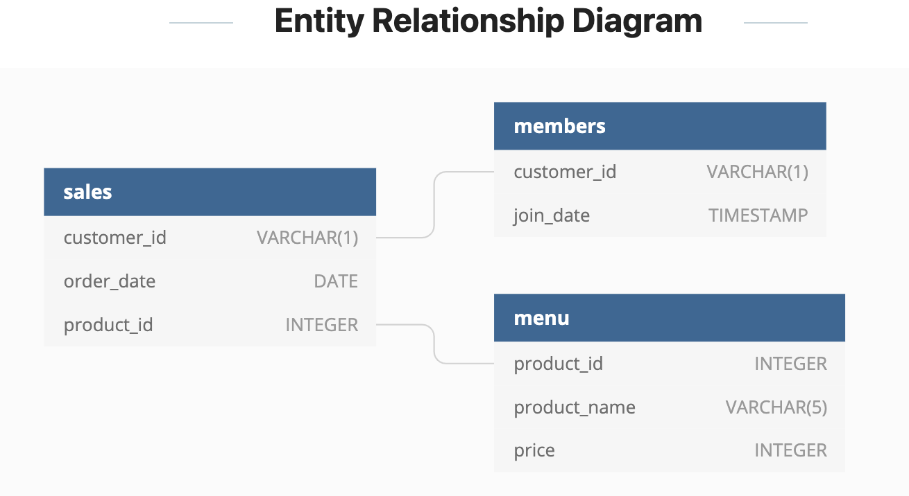

# Week 1 Challenge!


For more information about the <a href="https://8weeksqlchallenge.com/case-study-1/">week 1</a> challenge. 

### Introduction
This week we are looking at Danny's Diner, a Japanese restaurant which began in 2021. The diner needs help staying afloat so they asked me to help with a basic analysis using the limited data that has been gathered.

### Problem Statement
To help stay afloat we have been tasked with answering a few simple questions about the customers of the diner, especially about their visiting patterns, which items are their favorites and how much they have spent. The goal of Danny's Diner after the analysis is over with would be to have enough of an understanding of the customers to expand the existing loyalty program that is already in place.

### Data
Danny is proving me 3 datasets to use for the analysis
 - Sales
 - Menu
 - Members
Along with an entity relationship diagram (ERD henceforth).



### Questions
Danny has provided me 10 questions he is seeking to get more information about regarding his customers and the business. To answer each question I will have the SQL script and the output of the the script.

**Stay tuned until the end for any parting thoughts on the challenge and what we could do for further analysese at the end.**


1. What is the total amount each customer spent at the restaurant?

```sql
SELECT
  sales.customer_id AS customer,
  SUM(menu.price) AS total_paid
FROM dannys_diner.sales AS sales
JOIN dannys_diner.menu AS menu
ON sales.product_id = menu.product_id
GROUP BY 1
ORDER BY total_paid DESC
```

| customer | total\_paid |
| -------- | ----------- |
| A        | 76          |
| B        | 74          |
| C        | 36          |

It looks like customer C does not like Japanese food as much as A and B

2. How many days has each customer visited the restaurant?

```sql
SELECT
  sales.customer_id AS customer,
  COUNT(DISTINCT order_date) AS frequency
FROM dannys_diner.sales AS sales
GROUP BY customer
ORDER BY frequency DESC
```

| customer | frequency |
| -------- | --------- |
| B        | 6         |
| A        | 4         |
| C        | 2         |

Maybe this is why customer C hasn't spent as much

3. What was the first item from the menu purchased by each customer?

```sql
with partition_orders as(
SELECT 
  sales.customer_id AS customer,
  menu.product_name,
  ROW_NUMBER() OVER(
    PARTITION BY sales.customer_id
      ORDER BY sales.order_date, sales.product_id) AS item_id
FROM dannys_diner.sales AS sales
JOIN dannys_diner.menu as menu
ON sales.product_id = menu.product_id
)

SELECT *
FROM partition_orders
WHERE item_id = 1
```

| customer | product\_name | item\_id |
| -------- | ------------- | -------- |
| A        | sushi         | 1        |
| B        | curry         | 1        |
| C        | ramen         | 1        |

4. What is the most purchased item on the menu and how many times was it purchased by all customers?

```sql
SELECT
  menu.product_name AS menu_item,
  COUNT(menu.product_name) AS frequency
FROM dannys_diner.sales AS sales
JOIN dannys_diner.menu AS menu
ON sales.product_id = menu.product_id
GROUP BY 1
LIMIT 1
```

| menu\_item | frequency |
| ---------- | --------- |
| ramen      | 8         |


5. Which item was the most popular for each customer?

```sql
with groupby_counts AS(
SELECT 
  sales.customer_id AS customer,
  menu.product_name AS menu_item,
  COUNT(*) AS frequency
FROM dannys_diner.sales AS sales
JOIN dannys_diner.menu AS menu
ON sales.product_id = menu.product_id
GROUP BY 1,2
),

rank_count AS (
SELECT
  *,
  RANK () OVER(PARTITION BY customer ORDER BY frequency DESC) AS top_choice
FROM groupby_counts
)

SELECT *
FROM rank_count
WHERE top_choice = 1
```
| customer | menu\_item | frequency | top\_choice |
| -------- | ---------- | --------- | ----------- |
| A        | ramen      | 3         | 1           |
| B        | sushi      | 2         | 1           |
| B        | curry      | 2         | 1           |
| B        | ramen      | 2         | 1           |
| C        | ramen      | 3         | 1           |


### Note:
To answer the following questions, I am creating the following temp table rather than having the table as a CTE in all the queries. I am also going to assume that you cannot collect points unless you are a member. I.e. until you sign up for the membership you do not collect any points.

```sql
DROP TABLE IF EXISTS membership;
CREATE TEMP TABLE membership AS
SELECT
  sales.customer_id,
  sales.order_date,
  menu.product_name,
  menu.price,
  members.join_date,
  CASE WHEN sales.order_date >= members.join_date
    THEN 'x'
    ELSE ''
    END AS member
FROM dannys_diner.sales AS sales
JOIN dannys_diner.menu AS menu
ON sales.product_id = menu.product_id
JOIN dannys_diner.members AS members
ON sales.customer_id = members.customer_id
WHERE join_date IS NOT NULL
ORDER BY member DESC;
```

| customer\_id | order\_date              | product\_name | price | join\_date               | member |
| ------------ | ------------------------ | ------------- | ----- | ------------------------ | ------ |
| A            | 2021-01-07T00:00:00.000Z | curry         | 15    | 2021-01-07T00:00:00.000Z | x      |
| A            | 2021-01-11T00:00:00.000Z | ramen         | 12    | 2021-01-07T00:00:00.000Z | x      |
| A            | 2021-01-11T00:00:00.000Z | ramen         | 12    | 2021-01-07T00:00:00.000Z | x      |
| A            | 2021-01-10T00:00:00.000Z | ramen         | 12    | 2021-01-07T00:00:00.000Z | x      |
| B            | 2021-01-11T00:00:00.000Z | sushi         | 10    | 2021-01-09T00:00:00.000Z | x      |
| B            | 2021-01-16T00:00:00.000Z | ramen         | 12    | 2021-01-09T00:00:00.000Z | x      |
| B            | 2021-02-01T00:00:00.000Z | ramen         | 12    | 2021-01-09T00:00:00.000Z | x      |
| B            | 2021-01-02T00:00:00.000Z | curry         | 15    | 2021-01-09T00:00:00.000Z |        |
| B            | 2021-01-01T00:00:00.000Z | curry         | 15    | 2021-01-09T00:00:00.000Z |        |
| A            | 2021-01-01T00:00:00.000Z | sushi         | 10    | 2021-01-07T00:00:00.000Z |        |
| A            | 2021-01-01T00:00:00.000Z | curry         | 15    | 2021-01-07T00:00:00.000Z |        |
| B            | 2021-01-04T00:00:00.000Z | sushi         | 10    | 2021-01-09T00:00:00.000Z |        |


6. Which item was purchased first by the customer after they became a member?

```sql
SELECT 
  customer_id AS customer,
  product_name AS item,
  MIN(join_date) AS join_date
FROM membership
WHERE member = 'x'
GROUP BY 1,2
```

| customer | item  | join\_date               |
| -------- | ----- | ------------------------ |
| A        | curry | 2021-01-07T00:00:00.000Z |
| A        | ramen | 2021-01-07T00:00:00.000Z |
| B        | ramen | 2021-01-09T00:00:00.000Z |
| B        | sushi | 2021-01-09T00:00:00.000Z |

7. Which item was purchased just before the customer became a member?

```sql
with groupby_counts AS(
SELECT 
  customer_id AS customer,
  product_name AS item,
  order_date,
  RANK() OVER(
    PARTITION BY customer_id ORDER BY order_date) AS last_item
FROM membership
WHERE member != 'x'
GROUP BY 1,2,3
ORDER BY 1
)

SELECT *
FROM groupby_counts
WHERE last_item = 1
```
| customer | item  | order\_date              | last\_item |
| -------- | ----- | ------------------------ | ---------- |
| A        | sushi | 2021-01-01T00:00:00.000Z | 1          |
| A        | curry | 2021-01-01T00:00:00.000Z | 1          |
| B        | curry | 2021-01-01T00:00:00.000Z | 1          |


8. What is the total items and amount spent for each member before they became a member?

```sql
SELECT
  customer_id AS customer,
  count(*) AS total_bought_items,
  SUM(price) AS total_spent
FROM membership
WHERE member = ''
GROUP BY 1
```

| customer | total\_bought\_items | total\_spent |
| -------- | -------------------- | ------------ |
| A        | 2                    | 25           |
| B        | 3                    | 40           |


9. If each $1 spent equates to 10 points and sushi has a 2x points multiplier - how many points would each customer have?

```sql
with points_earned AS(
SELECT 
  *,
  CASE WHEN product_name = 'sushi' THEN price*20
       ELSE price*10 END AS points_earned
FROM membership
WHERE member = 'x'
)

SELECT
  customer_id AS customer,
  SUM(points_earned) AS pointed_earned
FROM points_earned
GROUP BY 1
ORDER BY 2 DESC
```
| customer | pointed\_earned |
| -------- | --------------- |
| A        | 510             |
| B        | 440             |

10. In the first week after a customer joins the program (including their join date) they earn 2x points on all items, not just sushi - how many points do customer A and B have at the end of January?

```sql
with points_earned AS(
SELECT 
  *,
  CASE WHEN DATE_PART('day', order_date::date) - DATE_PART('day', join_date::date) <=7 THEN price*20
       WHEN DATE_PART('day', order_date::date) - DATE_PART('day', join_date::date) >7 AND product_name = 'sushi' THEN price*20
       WHEN DATE_PART('day', order_date::date) - DATE_PART('day', join_date::date) >7 AND (product_name = 'curry' OR product_name = 'ramen') THEN price*10
       END AS points_earned
FROM membership
WHERE member = 'x' AND EXTRACT(MONTH FROM order_date) = 1
)

SELECT
  customer_id AS customer,
  SUM(points_earned) AS january_points
FROM points_earned
GROUP BY 1
ORDER BY 2 DESC
```

| customer | january\_points |
| -------- | --------------- |
| A        | 1020            |
| B        | 440             |


### End Thoughts
This was a fun dataset to analyze and brought back memories. I have worked in various pizza restaurants in high school and in college so it was fun to work with this type of data.

As the restaurant grows and more data is collected modularizing the data would be beneficial to allow for others in the future have the data at a click of a few buttons rather than having to create the queries again. Using a tool like dbt would allow for this and even put it through a visualization tool (Looker or Tableau) for the managers to make decisions easier. 

**Future Analyses:**
- Food costs
- Customer Acquisition Cost
- Lifetime Value
- Trending of busy times to optimize when employees are scheduled to work
- Etc.