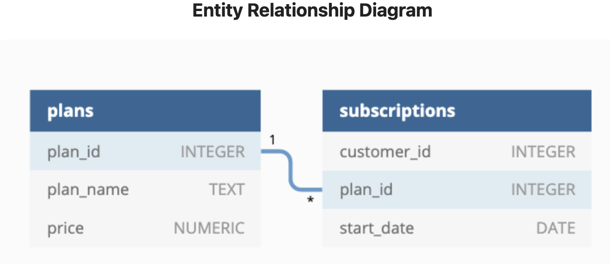

# Week 3 Challenge!


For more information about the <a href="https://8weeksqlchallenge.com/case-study-3/">week 3</a> challenge. 

### Introduction
Danny loves cooking and streaming shows. He realized that there was a large gap in the market, namely, the food related content only streaming network! From this realization, Danny has decided to enlist me as part of the original startup team for Foodie-Fi. Foodie-Fi plans on selling monthly and annual subscriptions, giving their customers unlimited on demand access to world wide food videos.

### Problem Statement
To increase the number of subscriptions, I have been tasked with analyzing digital data about our current users. Danny is looking for a description about each customer's onboarding journey and then the analytical questions.
### Data
Danny is proving me 2 datasets to use for the analysis
 - plans
 - subscriptions

Along with an ERD.



### Questions

Onboarding Customer Journey Description.

Data Analysis Questions:

1. How many customers has Foodie-Fi ever had?

```sql
SELECT
  COUNT (DISTINCT customer_id) AS total_unique_customers
FROM foodie_fi.subscriptions
```

| total\_unique\_customers |
| ------------------------ |
| 1000                     |

2. What is the monthly distribution of trial plan start_date values for our dataset - use the start of the month as the group by value

```sql
with trial_plans AS(
  SELECT
    subs.customer_id AS customer,
    subs.start_date AS start_date
  FROM
    foodie_fi.subscriptions AS subs
    JOIN foodie_fi.plans AS plans ON subs.plan_id = plans.plan_id
  WHERE
    plan_name = 'trial'
  ORDER BY
    customer_id
) 
SELECT
  DATE_PART('month', start_date) AS month,
  COUNT(*) AS frequency,
  ROUND(COUNT(*) :: NUMERIC / SUM(COUNT(*)) OVER (), 3) * 100 AS percentage
FROM trial_plans
GROUP BY 1
ORDER BY month
```

| month | frequency | percentage |
| ----- | --------- | ---------- |
| 1     | 88        | 8.800      |
| 2     | 68        | 6.800      |
| 3     | 94        | 9.400      |
| 4     | 81        | 8.100      |
| 5     | 88        | 8.800      |
| 6     | 79        | 7.900      |
| 7     | 89        | 8.900      |
| 8     | 88        | 8.800      |
| 9     | 87        | 8.700      |
| 10    | 79        | 7.900      |
| 11    | 75        | 7.500      |
| 12    | 84        | 8.400      |

3. What plan start_date values occur after the year 2020 for our dataset? Show the breakdown by count of events for each plan_name

```sql
SELECT 
  plans.plan_name AS plan_name,
  COUNT(*) AS events
FROM foodie_fi.subscriptions AS subs
JOIN foodie_fi.plans AS plans
ON subs.plan_id = plans.plan_id
WHERE DATE_PART('year', subs.start_date) = 2021
GROUP BY 1
ORDER BY 2 DESC
```

| plan\_name    | events |
| ------------- | ------ |
| churn         | 71     |
| pro annual    | 63     |
| pro monthly   | 60     |
| basic monthly | 8      |

4. What is the customer count and percentage of customers who have churned rounded to 1 decimal place?

```sql
SELECT 
  SUM(CASE WHEN plans.plan_name ='churn' THEN 1 ELSE 0 END) AS customer_churn,
  ROUND(
        100 * SUM(CASE WHEN plans.plan_name ='churn' THEN 1 ELSE 0 END)::NUMERIC /
        COUNT(DISTINCT subs.customer_id), 1
  ) AS percentage
FROM foodie_fi.subscriptions AS subs
JOIN foodie_fi.plans AS plans
ON subs.plan_id = plans.plan_id
```

| customer\_churn | percentage |
| --------------- | ---------- |
| 307             | 30.7       |


5. What is the number and percentage of customer plans after their initial free trial?

```sql
WITH ranked_plans AS(
  SELECT
    customer_id,
    plan_id,
    ROW_NUMBER() OVER(
      PARTITION BY customer_id
      ORDER BY start_date DESC
    )
  FROM foodie_fi.subscriptions
)
SELECT
  plans.plan_id,
  plans.plan_name,
  COUNT(*) AS total_customers,
  ROUND(100 * COUNT(*) / SUM(COUNT(*)) OVER(), 1) AS percentage
FROM ranked_plans
INNER JOIN foodie_fi.plans as plans
ON ranked_plans.plan_id = plans.plan_id
GROUP BY plans.plan_id, plans.plan_name
ORDER BY plans.plan_id
```
| plan\_id | plan\_name    | total\_customers | percentage |
| -------- | ------------- | ---------------- | ---------- |
| 0        | trial         | 1000             | 37.7       |
| 1        | basic monthly | 546              | 20.6       |
| 2        | pro monthly   | 539              | 20.3       |
| 3        | pro annual    | 258              | 9.7        |
| 4        | churn         | 307              | 11.6       |

6. How many customers have upgraded to an annual plan in 2020?

```sql
SELECT 
  plan_id,
  COUNT(DISTINCT customer_id) AS total_annual_customers
FROM foodie_fi.subscriptions
WHERE plan_id = '3' AND start_date BETWEEN '2020-01-01' AND '2020-12-31'
GROUP BY 1
```
| plan\_id | total\_annual\_customers |
| -------- | ------------------------ |
| 3        | 195                      |

