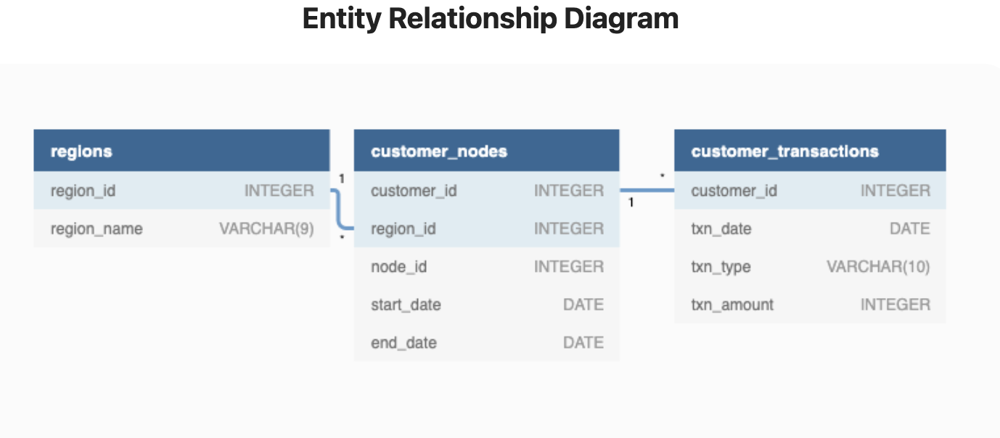

# Week 4 Challenge!


For more information about the <a href="https://8weeksqlchallenge.com/case-study-4/">week 4</a> challenge. 

### Introduction
There is a new wave in the financial industry called Neo-Banks, new aged digital only banks. Data Bank runs just like any other digital bank, but it isn't only for banking activities, they also have the world's most secture distributed data storage platform.

### Problem Statement
Danny has asked us to calculate different metrics, growth and helping the business analyze their data in a smarter way to better forecast and plan their future developments.

### Data
#### Table 1: Regions
The data runs off a network of nodes where both money and data is stored across the globe. Think if these nodes as a bank branch/store that exists around the world.
#### Table 2: Customer Nodes
Customers are randomly distributed across the nodes according to their region. The distribution changes frequently to reduce the risk of hackers.
#### Table 3: Customer Transactions
This stores all customer deposits, withdrawls and purchases made using their Data Bank debit card.

Along with an ERD.



### Questions

#### Customer Nodes Exploration
1. How many unique nodes are there on the Data Bank system?
```sql
WITH nodes_count AS (
  SELECT DISTINCT node_id
  FROM data_bank.customer_nodes
)
SELECT
  COUNT(*) AS unique_nodes
FROM nodes_count
```
| unique\_nodes |
| ------------- |
| 5             |

2. What is the number of nodes per region?
```sql
SELECT
  regions.region_name,
  COUNT(DISTINCT nodes.node_id) AS number_nodes
FROM data_bank.customer_nodes AS nodes
JOIN data_bank.regions AS regions
ON nodes.region_id = regions.region_id
GROUP BY region_name
ORDER BY region_name
```
| region\_name | number\_nodes |
| ------------ | ------------- |
| Africa       | 5             |
| America      | 5             |
| Asia         | 5             |
| Australia    | 5             |
| Europe       | 5             |

3. How many customers are allocated to each region?
```sql
SELECT
  regions.region_name,
  COUNT(DISTINCT nodes.customer_id) AS number_customers
FROM data_bank.customer_nodes AS nodes
JOIN data_bank.regions AS regions
ON nodes.region_id = regions.region_id
GROUP BY region_name
ORDER BY 2 DESC
```
| region\_name | number\_customers |
| ------------ | ----------------- |
| Australia    | 110               |
| America      | 105               |
| Africa       | 102               |
| Asia         | 95                |
| Europe       | 88                |

#### Customer Transactions
1. What is the unique count and total amount for each transaction type?
```sql
SELECT
  DISTINCT txn_type,
  COUNT(*) AS unique_count,
  SUM(txn_amount) AS total_amount
FROM data_bank.customer_transactions
GROUP BY 1
```
| txn\_type  | unique\_count | total\_amount |
| ---------- | ------------- | ------------- |
| deposit    | 2671          | 1359168       |
| purchase   | 1617          | 806537        |
| withdrawal | 1580          | 793003        |

2. What is the average total historical deposit counts and amounts for all customers?
```sql
WITH customers AS(
  SELECT
    customer_id,
    COUNT(*) AS deposit_count,
    SUM(txn_amount) AS total_deposit_amount
  FROM data_bank.customer_transactions
  WHERE txn_type = 'deposit'
  GROUP BY customer_id
)

SELECT 
  ROUND(AVG(deposit_count)) AS average_deposit_count,
  ROUND(sum(total_deposit_amount) / sum(deposit_count)) AS average_deposit_amount
FROM customers
```
| average\_deposit\_count | average\_deposit\_amount |
| ----------------------- | ------------------------ |
| 5                       | 509                      |

3. For each month - how many Data Bank customers make more than 1 deposit and either 1 purchase or 1 withdrawal in a single month?
```sql
WITH customer_months AS(
  SELECT
    DATE_TRUNC('mon', txn_date)::DATE AS month,
    customer_id,
    SUM(CASE WHEN txn_type = 'deposit' THEN 0 ELSE 1 END) AS deposit_count,
    SUM(CASE WHEN txn_type = 'purchase' THEN 0 ELSE 1 END) AS purchase_count,
    SUM(CASE WHEN txn_type = 'withdrawl' THEN 0 ELSE 1 END) AS withdrawl_count
  FROM data_bank.customer_transactions
  GROUP BY month, customer_id
)

SELECT
  month,
  COUNT(DISTINCT customer_id) AS customer
FROM customer_months
WHERE deposit_count >= 1 AND (purchase_count > 1 OR withdrawl_count > 1 )
GROUP BY month
ORDER BY month
```
| month                    | customer |
| ------------------------ | -------- |
| 2020-01-01T00:00:00.000Z | 295      |
| 2020-02-01T00:00:00.000Z | 365      |
| 2020-03-01T00:00:00.000Z | 377      |
| 2020-04-01T00:00:00.000Z | 178      |

