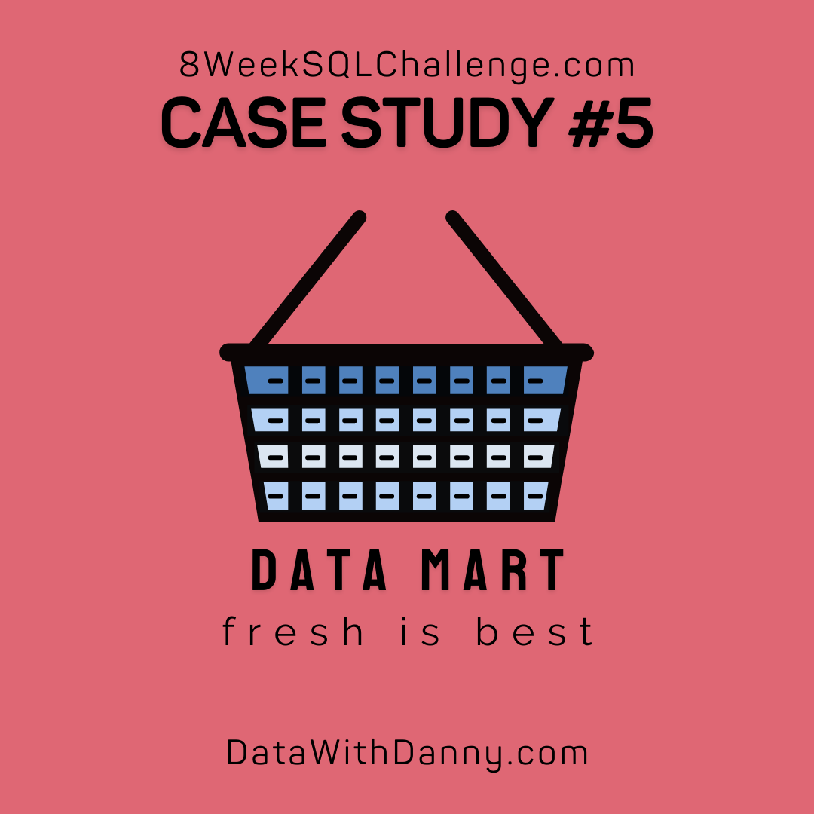

# Week 5 Challenge!


For more information about the <a href="https://8weeksqlchallenge.com/case-study-5/">week 5</a> challenge. 

### Introduction
In June, large scale supply changes were made at Data Mart. All products now use sustainable packaging methods in every single step from the farm to customer. Danny needs help to quantify the impacts of this change on the sales performance.

### Problem Statement
Danny has 3 key questions he wants us to help solve.
    - What was the quantifiable impact of the changes introduced?
    - Which platform, region, segment and customer types were the most impacted by this change?
    - What can we do about future introductions of similar sustainability updates to the business to minimize impact on sales?

### Data
The data in this study also needs cleaning prior to being able to analyze the data.
Steps taken to clean the data:
    1. Convert the week_date to a DATE format
    2. Add a week_number as the second column for each week_date value
    3. Add a month_number with the calendar month for each week_date value as the 3rd column
    4. Add a calendar_year column as the 4th coulmn containing either 2018,2019,2020
    5. Add a column called age_band after the original segment using the following
        - 1 -> Young Adult
        - 2 -> Middle Aged
        - 3 or 4 -> Retirees
    6. Add a demographic column using the following segment values
        - C -> Couples
        - F -> Families
    7. Ensure all null string values with an "Unknown" string in the original segment column as well as the new age_band and demographics
    8. Generate a new avg_transaction column as the sales value divided by transactions rounded to 2 decimal places.

```sql
DROP TABLE IF EXISTS data_mart.clean_weekly_sales;
CREATE TABLE data_mart.clean_weekly_sales AS
SELECT 
  TO_DATE(week_date, 'DD/MM/YY') AS week_date,
  DATE_PART('week', TO_DATE(week_date, 'DD/MM/YY')) AS week_number,
  DATE_PART('mon', TO_DATE(week_date, 'DD/MM/YY')) AS month_number,
  DATE_PART('year', TO_DATE(week_date, 'DD/MM/YY')) AS year,
  region,
  platform,
  CASE 
    WHEN right(segment, 1) = '1' THEN 'Young Adult'
    WHEN right(segment, 1) = '2' THEN 'Middle Aged'
    WHEN right(segment, 1) IN('3','4') THEN 'Retirees'
    ELSE 'Unknown'
  END AS age_band,
  CASE
    WHEN left(segment, 1) = 'C' THEN 'Couples'
    WHEN left(segment, 1) = 'F' THEN 'Families'
    ELSE 'Unknown'
  END AS demographics,
  customer_type,
  transactions,
  sales,
  ROUND(sales / transactions, 2) as avg_transaction
FROM data_mart.weekly_sales;
```

I will be using the newly constructed cleaned table for the following analysis
#### Data Exploration:
1. What day of the week is used for each week_date value?
```sql
SELECT 
  TO_CHAR(week_date,'Day') AS day_of_week
FROM data_mart.clean_weekly_sales
LIMIT 1
```
| day\_of\_week |
| ------------- |
| Monday        |

2. What range of week numbers are missing from the dataset?

This doesn't exactly answer the question but it allows us to see what numbers are missing. The numbers are 1-12 and 37-52.
```sql
SELECT week_number
FROM data_mart.clean_weekly_sales
GROUP BY 1
ORDER BY 1
```
| week\_number |
| ------------ |
| 13           |
| 14           |
| 15           |
| 16           |
| 17           |
| 18           |
| 19           |
| 20           |
| 21           |
| 22           |
| 23           |
| 24           |
| 25           |
| 26           |
| 27           |
| 28           |
| 29           |
| 30           |
| 31           |
| 32           |
| 33           |
| 34           |
| 35           |
| 36           |

3. How many total transactions were there for each year in the dataset?

```sql
SELECT 
  year,
  sum(transactions) as total_transactions
FROM data_mart.clean_weekly_sales
group by 1
order by 1
```
| year | total\_transactions |
| ---- | ------------------- |
| 2018 | 346406460           |
| 2019 | 365639285           |
| 2020 | 375813651           |

4. What is the total sales for each region for each month?

```sql
SELECT 
  year,
  month_number,
  region,
  RANK () OVER ( 
		PARTITION BY year, month_number
		ORDER BY sum(sales) DESC
	) sales_rank,
  sum(sales) as total_sales
FROM data_mart.clean_weekly_sales
GROUP BY 1, 2, 3
ORDER BY 1
LIMIT 7
```
| year | month\_number | region        | sales\_rank | total\_sales |
| ---- | ------------- | ------------- | ----------- | ------------ |
| 2018 | 3             | OCEANIA       | 1           | 175777460    |
| 2018 | 3             | AFRICA        | 2           | 130542213    |
| 2018 | 3             | ASIA          | 3           | 119180883    |
| 2018 | 3             | USA           | 4           | 52734998     |
| 2018 | 3             | CANADA        | 5           | 33815571     |
| 2018 | 3             | SOUTH AMERICA | 6           | 16302144     |
| 2018 | 3             | EUROPE        | 7           | 8402183      |

5. What is the total count of transactions for each platform

```sql
SELECT 
  platform,
  sum(transactions) as total_transactions
FROM data_mart.clean_weekly_sales
GROUP BY 1
ORDER BY 2 DESC
```
| platform | total\_transactions |
| -------- | ------------------- |
| Retail   | 1081934227          |
| Shopify  | 5925169             |

6. What is the percentage of sales for Retail vs Shopify for each month?

```sql
with platform_total_sales AS(
SELECT 
  year,
  month_number,
  platform,
  sum(sales) as monthly_total_sales
FROM data_mart.clean_weekly_sales
GROUP BY 1, 2, 3
ORDER BY 1, 2, 4 DESC
)

SELECT
  year,
  month_number,
  ROUND(
    100 * MAX(CASE WHEN platform = 'Retail' then monthly_total_sales ELSE NULL END)/sum(monthly_total_sales)
    ,2) AS retail_percent,
    ROUND(
    100 * MAX(CASE WHEN platform = 'Shopify' then monthly_total_sales ELSE NULL END)/sum(monthly_total_sales)
    ,2) AS shopify_percent
  FROM platform_total_sales
  GROUP BY 1,2
  ```
  | year | month\_number | retail\_percent | shopify\_percent |
| ---- | ------------- | --------------- | ---------------- |
| 2018 | 3             | 97.92           | 2.08             |
| 2018 | 4             | 97.93           | 2.07             |
| 2018 | 5             | 97.73           | 2.27             |
| 2018 | 6             | 97.76           | 2.24             |
| 2018 | 7             | 97.75           | 2.25             |
| 2018 | 8             | 97.71           | 2.29             |
| 2018 | 9             | 97.68           | 2.32             |
| 2019 | 3             | 97.71           | 2.29             |
| 2019 | 4             | 97.80           | 2.20             |
| 2019 | 5             | 97.52           | 2.48             |
| 2019 | 6             | 97.42           | 2.58             |
| 2019 | 7             | 97.35           | 2.65             |
| 2019 | 8             | 97.21           | 2.79             |
| 2019 | 9             | 97.09           | 2.91             |
| 2020 | 3             | 97.30           | 2.70             |
| 2020 | 4             | 96.96           | 3.04             |
| 2020 | 5             | 96.71           | 3.29             |
| 2020 | 6             | 96.80           | 3.20             |
| 2020 | 7             | 96.67           | 3.33             |
| 2020 | 8             | 96.51           | 3.49             |

7. What is the percentage of sales by demographic for each year in the dataset?

```sql
SELECT
  year,
  demographics,
  SUM(sales) as yearly_sales,
  ROUND(
    (100 * sum(sales)::NUMERIC / SUM(sum(sales)) OVER(PARTITION BY demographics))::NUMERIC
  ,2) AS percentage
FROM data_mart.clean_weekly_sales
GROUP BY 1,2
ORDER BY 1,2
```
| year | demographics | yearly\_sales | percentage |
| ---- | ------------ | ------------- | ---------- |
| 2018 | Couples      | 3402388688    | 30.38      |
| 2018 | Families     | 4125558033    | 31.25      |
| 2018 | Unknown      | 5369434106    | 32.86      |
| 2019 | Couples      | 3749251935    | 33.47      |
| 2019 | Families     | 4463918344    | 33.81      |
| 2019 | Unknown      | 5532862221    | 33.86      |
| 2020 | Couples      | 4049566928    | 36.15      |
| 2020 | Families     | 4614338065    | 34.95      |
| 2020 | Unknown      | 5436315907    | 33.27      |

8. Which age_band and demographic values contribute the most to Retail sales?

```sql
SELECT
  age_band,
  demographics,
  ROUND(100*SUM(sales) / SUM(SUM(sales)) OVER(), 2) AS sales_contribution_percent
FROM data_mart.clean_weekly_sales
WHERE platform = 'Retail'
GROUP BY 1,2
ORDER BY 3 DESC
```
| age\_band    | demographics | sales\_contribution\_percent |
| ------------ | ------------ | ---------------------------- |
| Unknown      | Unknown      | 40.52                        |
| Retirees     | Families     | 16.73                        |
| Retirees     | Couples      | 16.07                        |
| Middle Aged  | Families     | 10.98                        |
| Young Adults | Couples      | 6.56                         |
| Middle Aged  | Couples      | 4.68                         |
| Young Adults | Families     | 4.47                         |

9. Can we use the avg_transaction column to find the average transaction size for each year for Retail vs Shopify? If not - how would you calculate it instead?

The answer is no, we cannot use the avg_transaction column. If we were to use that column we would essentially be finding the average of the average. So to calculate the annual average transaction size, we have to find the sum of sales and sum of transactions for each year.
```sql
SELECT 
  year,
  platform,
  SUM(sales)/ sum(transactions) AS avg_annual_transaction
FROM data_mart.clean_weekly_sales
GROUP BY 1,2
ORDER BY 1,3 DESC
```
| year | platform | avg\_annual\_transaction |
| ---- | -------- | ------------------------ |
| 2018 | Shopify  | 192                      |
| 2018 | Retail   | 36                       |
| 2019 | Shopify  | 183                      |
| 2019 | Retail   | 36                       |
| 2020 | Shopify  | 179                      |
| 2020 | Retail   | 36                       |

#### Before & After Analysis
This technique is usually used when we inspect an important event and want to inspect the impact before and after a certain point in time.

Taking the week_date value of 2020-06-15 as the baseline week where the Data Mart sustainable packaging changes came into effect.

We would include all week_date values for 2020-06-15 as the start of the period after the change and the previous week_date values would be before

Using this analysis approach - answer the following questions:
1. What is the total sales for the 4 weeks before and after 2020-06-15? What is the growth or reduction rate in actual values and percentage of sales?

```sql
SELECT week_number
FROM data_mart.clean_weekly_sales
WHERE week_date = '2020-06-15'
LIMIT 1
```
| week\_number |
| ------------ |
| 25           |

We will need to find the 4 weeks before and after 25 to then get the sales and percent change
```sql
with cte_2020 as(
SELECT 
  CASE
    WHEN week_number BETWEEN 21 AND 24 THEN '4_weeks_prior'
    WHEN week_number BETWEEN 25 AND 28 THEN '4_weeks_after'
  END AS period_name,
  SUM(sales) AS total_sales,
  SUM(transactions) AS total_transactions,
  SUM(sales) / SUM(transactions) AS avg_transaction
FROM data_mart.clean_weekly_sales
WHERE week_number BETWEEN 21 and 28
  AND year = '2020'
GROUP BY period_name
),

sales_difference AS(
SELECT 
  period_name,
  total_sales - LAG(total_sales) OVER (ORDER BY period_name) AS sales_diff,
  ROUND(
    100 * ((total_sales::NUMERIC / LAG(total_sales) OVER(ORDER BY period_name)) - 1), 2) AS percent_change
FROM cte_2020
)

SELECT
  sales_diff,
  percent_change
FROM sales_difference
WHERE sales_diff IS NOT NULL
```
| sales\_diff | percent\_change |
| ----------- | --------------- |
| 26884188    | 1.16            |